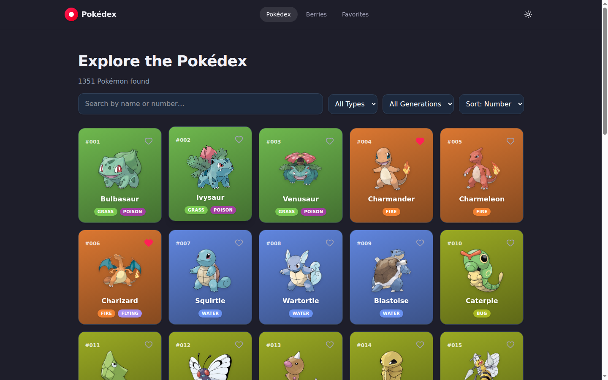
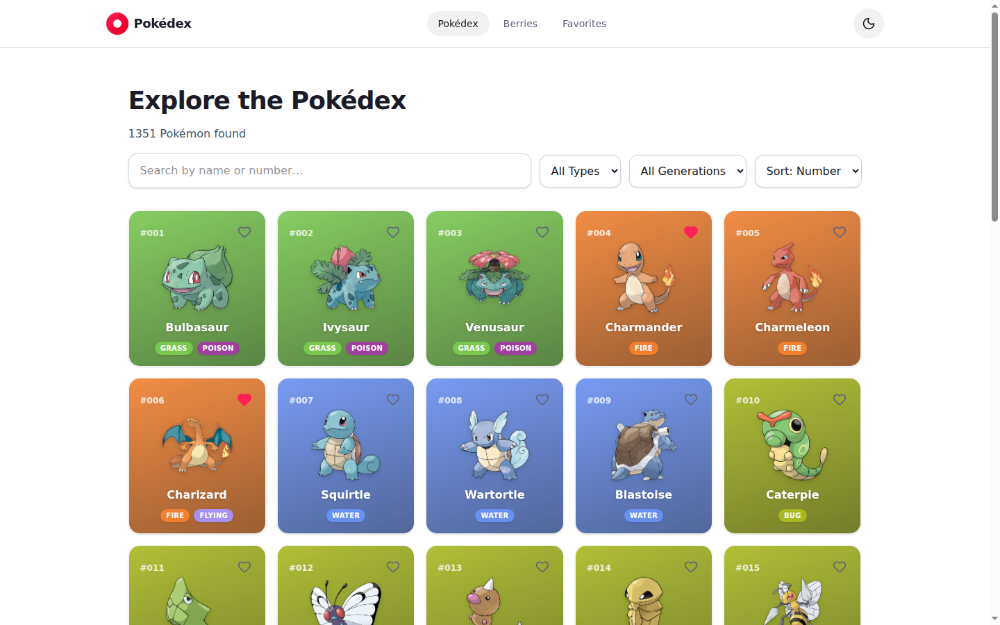
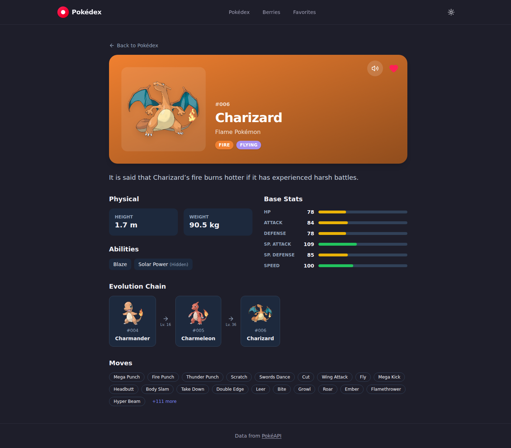
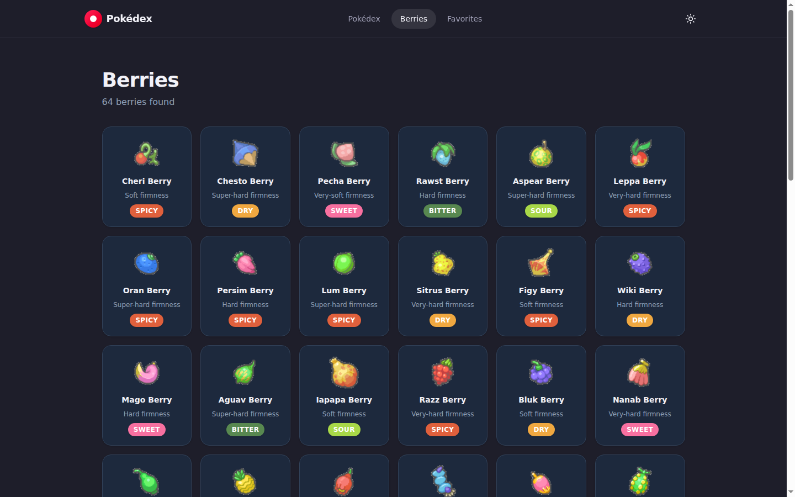
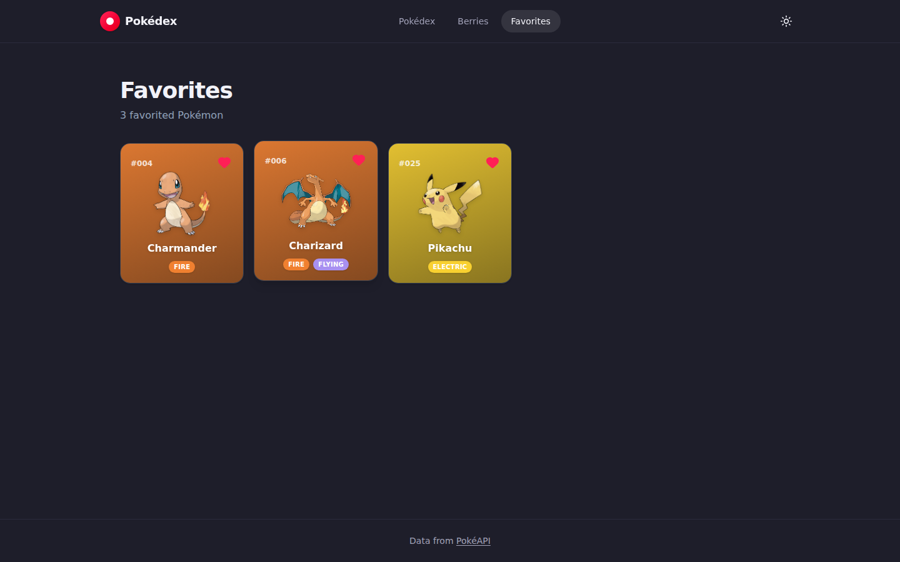

# Pokédex

[](https://github.com/AZagatti/pokedex-det-sm3/actions/workflows/ci.yml) [](https://github.com/AZagatti/pokedex-det-sm3/actions/workflows/deploy.yml)

A Pokédex web app built with SvelteKit, Tailwind CSS v4, and the [PokéAPI](https://pokeapi.co/).

Live: https://azagatti.github.io/pokedex-det-sm3/



## Features

- **Browse & search** — 1,351 Pokémon (including forms), search by name or dex number
- **Filter & sort** — by type, generation, and dex number/name, with infinite scroll
- **Detail pages** — artwork (with shiny toggle), cry playback, stats, abilities, moves, full evolution chains
- **Berries** — browse and inspect all 64 berries
- **Favorites** — persisted to `localStorage`, no account needed
- **Dark / light theme** — persisted, respects system preference on first visit
- **Fully responsive**, keyboard-accessible, and respects `prefers-reduced-motion`

## Screenshots

| Home (light) | Detail |
| --- | --- |
|  |  |

| Berries | Favorites |
| --- | --- |
|  |  |

## Tech stack

- [SvelteKit](https://svelte.dev/docs/kit) (Svelte 5 runes) + `adapter-static` (SPA mode, deployed to GitHub Pages)
- [Tailwind CSS v4](https://tailwindcss.com/)
- [Zod](https://zod.dev/) for runtime API response validation
- [Ultracite](https://ultracite.ai/) (Oxlint + Oxfmt) for linting/formatting
- [Lefthook](https://lefthook.dev/) for git hooks (lint on commit, typecheck + unit tests on push)
- [Vitest](https://vitest.dev/) for unit tests, [Playwright](https://playwright.dev/) for e2e tests
- GitHub Actions for CI (lint, typecheck, tests) and CD (deploy to GitHub Pages)

## Development

```sh
npm install
npm run dev       # start dev server
npm run build     # production build to build/
npm run preview   # preview the production build
npm run lint       # ultracite check
npm run lint:fix   # ultracite fix
npm run typecheck  # svelte-check
npm run test:unit  # vitest
npm run test:e2e   # playwright (builds + previews first)
npm run test       # unit + e2e
```

Git hooks are installed via `npx lefthook install` (runs automatically after `npm install`). Pre-commit lints staged files; pre-push runs typecheck + unit tests.
